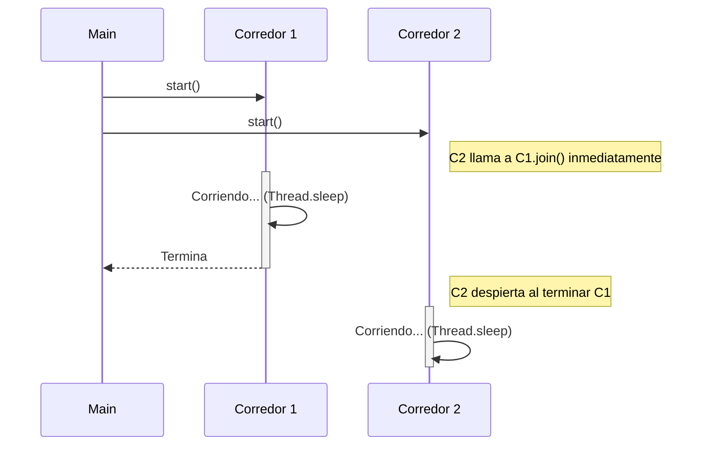
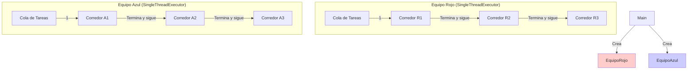

# Taller - 🏃‍♂️  La Gran Carrera de Relevos Multihilo

# Creacion del proyecto

## En este proyecto se hizo utilizando hilos para ver como es el uso de la concurrencia en java, en este caso hicimos dos usos de los hilos con la implementacion 'Thread' Y 'Runnable' en este caso UTILIZAMOS DOS RAMAS:

# RAMA 1: "main"

## esta rama implentamos Thread para su uso

# RAMA 1: "Runnable"

## esta rama implentamos Runnablepara su uso


**Objetivo:** Comprender el ciclo de vida de un hilo, la coordinación entre tareas dependientes (`join`) y la ejecución paralela de grupos independientes (Equipos) utilizando Java.

---

Estamos en los Juegos Olímpicos de Java. Existen 3 equipos competidores. Cada equipo tiene 3 corredores. En una carrera de relevos, el **Corredor 2** no puede comenzar hasta que el **Corredor 1** termine su tramo y le entregue el testigo. Sin embargo, el **Equipo Rojo** corre al mismo tiempo que el **Equipo Azul**.

------


## 1. Estructura del Proyecto


El proyecto debe seguir el patrón de diseño básico y separación de responsabilidades.

Plaintext

```
src/
└── com/
    └── relevos/
        ├── Main.java              // Punto de entrada, inicia la carrera
        └── dominio/
            ├── Corredor.java      // La tarea individual (Hilo)
            └── Equipo.java        // Gestor de los corredores de un equipo
```


### Diagrama de Clases

```
classDiagram
    class Main {
        +main(String[] args)
    }

    class Corredor {
        -String nombre
        -int distancia
        -Corredor anterior
        +Corredor(String nombre, Corredor anterior)
        +run()
        -correr()
        -pasarTestigo()
    }

    class Equipo {
        -String nombreEquipo
        -List~Corredor~ corredores
        +Equipo(String nombre)
        +iniciarCarrera()
        +run()
    }

    Main --> Equipo : Crea instancias
    Equipo *-- Corredor : Contiene 3
    Corredor --|> Thread : Hereda (o implementa Runnable)
```


### Diagrama de Secuencia (Lógica de Relevo)


Este diagrama explica cómo debe funcionar la sincronización interna de un equipo.

Fragmento de código



------


## 2. Instrucciones


### Paso 1: La clase `Corredor`


El corredor representa un hilo de ejecución. Debe simular el esfuerzo físico esperando un tiempo aleatorio.

**Requerimientos:**

1. Debe extender de `Thread`.
2. Debe tener un atributo `Corredor anterior`. Este atributo es clave para saber a quién esperar (Se puede usar la misma lógica del patron Chain Responsablity).
3. En el método `run()`, lo primero que debe hacer es verificar si hay un corredor anterior. Si lo hay, debe esperar a que termine usando `join()`.

**Template de Ayuda:**

```Java
package com.relevos.dominio;

import java.util.Random;

public class Corredor extends Thread {
    private String nombre;
    private Corredor anterior; // Referencia al compañero que corre antes

    public Corredor(String nombre, Corredor anterior) {
        this.nombre = nombre;
        this.anterior = anterior;
    }

    @Override
    public void run() {
        try {
            // RELEVO
            if (anterior != null) {
                System.out.println(this.nombre + " esperando el testigo de " + anterior.getNombre());
                // TODO: Usar el método join() sobre el objeto 'anterior'.
                // Esto pausa a ESTE corredor hasta que el anterior muera (termine).
            } else {
                System.out.println(this.nombre + " inicia la carrera ya!");
            }

            // CORRER
            System.out.println(this.nombre + " comenzo a correr 🏃");
            int tiempoCorrida = new Random().nextInt(2000) + 1000; // Entre 1 y 3 segundos
            Thread.sleep(tiempoCorrida);

            // FIN DEL TRAMO
            System.out.println(this.nombre + " termino su tramo y pasa el testigo ✋");
        } catch (InterruptedException e) {
            e.printStackTrace();
        }
    }

    public String getNombre() { return nombre; }
}
```


### Paso 2: La clase `Equipo`

Un equipo también puede ser un Hilo (`Thread`) que se encarga de preparar a sus corredores y lanzarlos. O puede ser una clase simple que orquesta el inicio. Para este taller, haremos que `Equipo` solo orqueste.

**Requerimientos:**

1. Recibir el nombre del equipo.
2. Crear 3 corredores.
3. **El Truco:** El Corredor 1 no tiene "anterior". El Corredor 2 tiene como "anterior" al 1. El Corredor 3 tiene como "anterior" al 2.
4. Iniciar todos los hilos (`start()`).

**Instrucciones para el estudiante:**

- Crea una lista o simplemente 3 variables: `c1`, `c2`, `c3`.
- Instancia `c1` pasando `null` como anterior.
- Instancia `c2` pasando `c1` como anterior.
- Instancia `c3` pasando `c2` como anterior.
- Llama a `.start()` en los tres. Gracias a la lógica del Paso 1, `c2` se pausará solo hasta que `c1` acabe.


### Paso 3: Clase `Main`

Debe crear al menos 2 equipos (ej. "Equipo Rojo" y "Equipo Azul") e iniciarlos simultáneamente.

Resultado Esperado en Consola:

Debe verse cómo los equipos avanzan en paralelo (intercalados), pero dentro de cada equipo, el orden se respeta estrictamente.

```text
[Rojo-1] inicia la carrera ya!
[Azul-1] inicia la carrera ya!
[Rojo-2] esperando el testigo de Rojo-1
[Azul-2] esperando el testigo de Azul-1
... (pausa) ...
[Rojo-1] terminó su tramo...
[Rojo-2] comenzó a correr...
...
```

------

# 3. Reto: Modernización a `ExecutorService`

El Comité Olímpico Internacional ha decidido modernizar su infraestructura. Crear hilos manualmente (`new Thread()`) es costoso para el sistema y difícil de escalar. Se te ha encargado refactorizar el código para usar un **Pool de Hilos** que administre a los corredores eficientemente.

En la versión anterior, usábamos `join()` para obligar al Corredor 2 a esperar al 1. En esta versión, usaremos una característica inteligente de los `ExecutorService`: **La ejecución secuencial**.

Si asignamos un `SingleThreadExecutor` (Ejecutor de un solo hilo) a cada **Equipo**, garantizamos que las tareas (corredores) se ejecuten en estricto orden de llegada (FIFO),
**¡simulando el relevo sin necesidad de programar esperas manuales!**

------


### 3.1. Instrucciones de Migración


#### Paso A: Refactorizar `Corredor` (De `Thread` a `Runnable`)

Ya no necesitamos que el corredor sepa a quién está esperando (`anterior`), ni que herede de `Thread`. Ahora será una "tarea pura".

1. Cambia `extends Thread` por `implements Runnable`.
2. Elimina el atributo `Corredor anterior` y la lógica del `join()`.
3. El método `run()` solo debe contener la lógica de correr (imprimir inicio, dormir, imprimir fin).

**Template `Corredor.java`:**

```Java
package com.relevos.dominio;

import java.util.Random;

public class Corredor implements Runnable {
    private String nombre;

    public Corredor(String nombre) {
        this.nombre = nombre;
    }

    @Override
    public void run() {
        try {
            System.out.println(this.nombre + " recibe el testigo y comienza a correr 🏃");

            // Esfuerzo
            int tiempo = new Random().nextInt(2000) + 1000;
            Thread.sleep(tiempo);

            System.out.println(this.nombre + " terminó su tramo y pasa el testigo ✋");
        } catch (InterruptedException e) {
            e.printStackTrace();
        }
    }
}
```


### Paso B: Refactorizar `Equipo` (El Administrador de Hilos)

Aquí ocurre la magia. En lugar de iniciar hilos manualmente, el equipo tendrá su propio **Ejecutor**.

1. Importa `java.util.concurrent.ExecutorService` y `Executors`.

2. En el constructor, inicializa un `ExecutorService` usando `Executors.newSingleThreadExecutor()`.

   > *¿Por qué?* Porque un equipo de relevos corre **uno a la vez**. Este ejecutor asegura que si mandas al Corredor 1, 2 y 3, se ejecutarán exactamente en ese orden.

3. Crea un método `iniciarCarrera()` que use `.execute(corredor)` para cada miembro.

4. **Importante:** No olvides llamar a `shutdown()` al final para liberar la memoria.

**Template `Equipo.java` :**

```Java
package com.relevos.dominio;

import java.util.concurrent.ExecutorService;
import java.util.concurrent.Executors;

public class Equipo {
    private String nombreEquipo;
    private ExecutorService organizador; // El "Thread Pool" del equipo

    public Equipo(String nombreEquipo) {
        this.nombreEquipo = nombreEquipo;
        // 💡 IMPORTANTE: Un SingleThreadExecutor garantiza orden secuencial [FIFO]
        // Es perfecto para un relevo
        this.organizador = Executors.newSingleThreadExecutor();
    }

    public void comenzarCarrera() {
        System.out.println("El equipo " + nombreEquipo + " esta listo en la línea de salida.");

        // Creamos las tareas (Runnables)
        Corredor c1 = new Corredor(nombreEquipo + "-1");
        Corredor c2 = new Corredor(nombreEquipo + "-2");
        Corredor c3 = new Corredor(nombreEquipo + "-3");

        // "Encolamos" a los corredores.
        // El ejecutor se encarga de hacerlos correr uno tras otro automáticamente.
        organizador.execute(c1);
        organizador.execute(c2);
        organizador.execute(c3);

        // Np acepta más corredores, pero termina los pendientes
        organizador.shutdown();
    }
}
```

------


#### 3.2. Diagrama del Nuevo Enfoque

Aquí se evidencia cómo cada Equipo tiene su propio "carril" (Hilo único) que procesa la cola de corredores.



## 3. Rúbrica de Evaluación


| **Criterio**                   | **Excelente (100)**                                          | **Regular (75)**                                             | **Aceptable (50)**                                           | **Insuficiente (10)**                    |
| ------------------------------ | ------------------------------------------------------------ | ------------------------------------------------------------ | ------------------------------------------------------------ | ---------------------------------------- |
| **Implementación de Runnable** | La clase `Corredor` implementa `Runnable` limpiamente. No contiene lógica de sincronización manual (`join` o referencias a otros corredores). | Implementa `Runnable` pero aún mantiene referencias innecesarias al corredor anterior (código sucio). | Sigue usando `extends Thread` a pesar de las instrucciones.  | No compila o no implementa la interfaz.  |
| **Uso de ExecutorService**     | Utiliza `Executors`correctamente dentro de la clase `Equipo`. Elige la estrategia adecuada (`newSingleThreadExecutor`) para garantizar el orden del relevo. | Usa `ExecutorService`, pero elige un pool incorrecto (ej. `FixedThreadPool(3)`) provocando que los 3 corredores del mismo equipo corran al mismo tiempo (rompiendo la regla del relevo). | Instancia el `Executor` pero olvida usar `.execute()` o sigue usando `.start()`manuales. | No utiliza el framework de Concurrencia. |
| **Gestión de Recursos**        | Implementa correctamente `shutdown()` para finalizar el servicio. El programa termina limpiamente. | Llama a `shutdown()` pero en el lugar incorrecto (antes de enviar las tareas). | No llama a `shutdown()`, dejando el proceso de Java "colgado" aunque la carrera termine. | El programa crashea.                     |
| **Comprensión del Modelo**     | El estudiante puede explicar por qué usar un *SingleThreadExecutor* por equipo reemplaza la necesidad de hacer `join()` manual. | El código funciona, pero el estudiante no entiende por qué los corredores no se atropellan entre sí. | El código funciona por suerte o copia, pero tiene errores conceptuales graves. | No funciona.                             |
